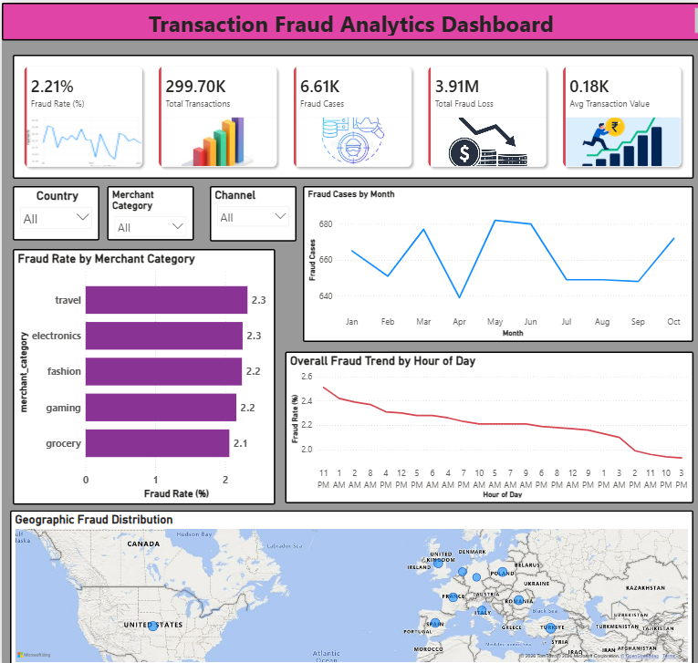
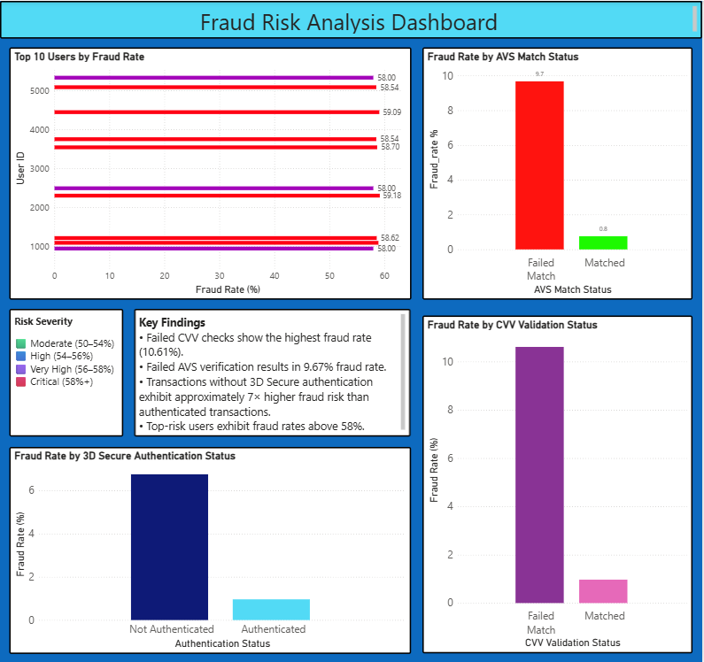

# 💳 Transaction Fraud Analytics and Risk Analysis

## 📋 Overview

The Transaction Fraud Analytics and Risk Assessment project focuses on analyzing fraudulent transaction patterns and identifying key risk indicators that contribute to payment fraud.

This end-to-end analytics project uses SQL for data processing and Power BI for interactive visualization to help organizations monitor fraud activity, assess financial losses, identify high-risk users, and improve fraud prevention strategies.

---

## 📁 Dataset

- **Source:** [Kaggle E-commerce Fraud detection dataset](https://www.kaggle.com/datasets/umuttuygurr/e-commerce-fraud-detection-dataset)
- **Database:** MySQL
- **Records:** ~300K Transactions
- **Attributes Include:**
  - Transaction Amount
  - Country
  - Merchant Category
  - Payment Channel
  - Fraud Flag
  - AVS Match Status
  - CVV Validation Status
  - 3D Secure Authentication Status
  - Transaction Timestamp
  - User ID

The dataset enables fraud trend analysis, risk profiling, and business intelligence reporting.

---

## 🎯 Objective

The main goals of this project are:

- Analyze transaction fraud patterns
- Measure fraud-related financial losses
- Identify high-risk users
- Evaluate fraud prevention controls
- Monitor fraud trends across time and geography
- Generate actionable business insights through dashboards

---

## 🛠️ Tools and Technologies

| Tool | Purpose |
| :--- | :--- |
| **MySQL** | Data storage and analytics |
| **SQL** | Data cleaning, transformation, and analysis |
| **Power BI** | Dashboard development and visualization |
| **DAX** | KPI calculations and measures |
| **Bing Maps** | Geographic fraud visualization |

---

## 🔍 Project Workflow

### 1. Data Preparation (SQL)

- Structured transaction data in MySQL
- Created analytical views for reporting
- Generated fraud-specific KPIs

### 2. Fraud Analytics Layer

Created SQL views including:

- Fraud Summary
- User Risk Profile
- Merchant Risk Analysis
- Country Risk Analysis
- Channel Risk Analysis
- Monthly Fraud Analysis
- Hourly Fraud Analysis
- AVS Analysis
- CVV Analysis
- 3DS Analysis

### 3. Risk Assessment

Fraud indicators were evaluated using:

- AVS Verification Status
- CVV Validation Status
- 3D Secure Authentication
- User Fraud Rates
- Merchant Risk Levels

### 4. Dashboard Development

Power BI dashboards were developed to provide:

- Executive fraud overview
- Risk assessment insights
- Trend monitoring
- Geographic analysis
- User risk profiling

---

# 📊 Dashboard 1: Transaction Fraud Analytics

The executive dashboard provides a high-level overview of fraud activity and business impact.

### Key KPIs

- **Fraud Rate:** 2.21%
- **Total Transactions:** 299.7K
- **Fraud Cases:** 6.61K
- **Total Fraud Loss:** 3.91M
- **Average Transaction Value:** 0.18K

### Key Visuals

#### 📈 Fraud Trend by Month
Tracks monthly fraud cases and identifies long-term fraud patterns.

#### ⏰ Fraud Rate by Hour of Day
Highlights high-risk transaction periods and supports time-based fraud monitoring.

#### 🏪 Fraud Rate by Merchant Category
Compares fraud exposure across merchant segments.

#### 🌍 Geographic Fraud Distribution
Visualizes fraud activity across countries and regions.

#### 🎛️ Interactive Filters
- Country
- Merchant Category
- Payment Channel

---

# 📊 Dashboard 2: Fraud Risk Analysis

This dashboard focuses on understanding the factors that contribute to fraud risk.

### Key Visuals

#### 👤 Top 10 High-Risk Users
Identifies users with the highest fraud rates and supports targeted fraud investigations.

#### 📍 AVS Verification Analysis

**Key Insight:**
Transactions that fail AVS verification exhibit significantly higher fraud rates compared to successfully verified transactions, making AVS mismatch a strong fraud indicator.

#### 🔐 CVV Validation Analysis

**Key Insight:**
Failed CVV validation records the highest fraud rate among all verification controls, indicating that incorrect card security details are strongly associated with fraudulent activity.

#### 🛡️ 3D Secure Authentication Analysis

**Key Insight:**
Transactions without 3D Secure authentication experience substantially higher fraud rates, highlighting the effectiveness of additional cardholder verification.

#### 🚨 Risk Severity Classification

Users categorized into:

- 🟩 Moderate Risk (50–54%)
- 🟦 High Risk (54–56%)
- 🟪 Very High Risk (56–58%)
- 🟥 Critical Risk (58%+)

---

## ✅ Results & Insights

- Failed CVV validation exhibited the highest fraud rate (**10.61%**).
- Failed AVS verification recorded a fraud rate of approximately **9.67%**.
- Transactions without 3D Secure authentication experienced significantly higher fraud risk.
- Travel and Electronics merchant categories showed elevated fraud rates.
- Multiple users were identified with fraud rates exceeding **58%**.
- Fraud activity remained consistent throughout the year, indicating persistent fraud exposure.
- Total fraud-related financial loss exceeded **₹3.9 Million**.

---

## 💼 Business Implications

- Strengthen monitoring of failed CVV and AVS transactions.
- Enforce 3D Secure authentication for high-risk transactions.
- Prioritize monitoring of Critical Risk users.
- Apply enhanced fraud controls to high-risk merchant categories.
- Implement risk-based transaction review processes.
- Use dashboard insights to support proactive fraud prevention strategies.

---

## 🏁 Conclusion

This project demonstrates how SQL and Power BI can be combined to transform transactional data into actionable fraud intelligence.

It showcases:

- SQL-based fraud analytics
- Risk assessment and profiling
- KPI-driven dashboard development
- Business intelligence reporting
- Data-driven fraud prevention insights

The resulting dashboards provide a centralized view of fraud activity and support informed decision-making for fraud management and risk mitigation.

---

## 🚀 Future Enhancements

- Machine Learning-based Fraud Prediction
- Dynamic Risk Scoring (0–100)
- Behavioral Fraud Analytics
- Real-Time Fraud Monitoring
- Automated Fraud Alert System
- Predictive Fraud Detection Models
